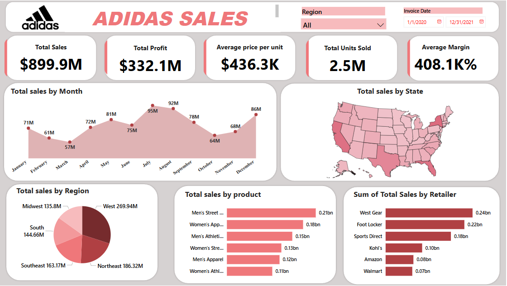

# 👟 Adidas Sales Dashboard (Power BI)

This project presents an interactive Power BI dashboard built using real-world Adidas sales data from Kaggle. It analyzes U.S. sales performance across regions, products, and retailers between 2020 and 2021.

---

## 📊 Dashboard Highlights

- 💰 **KPIs**: Total Sales, Total Profit, Total Units Sold, Operating Margin
- 📈 **Monthly Trend**: Visualizes sales progression over time
- 🗺️ **U.S. Sales Map**: State-wise performance using a filled map
- 🧍‍♂️ **Retailer & Region Analysis**: Compare retailer performance across different regions
- 🧾 **Product Insights**: View top-selling products and unit sales breakdown
- 🔄 Interactive slicers for Region and Invoice Date filtering

---

## 🔗 Live Dashboard

👉 [Click here to view the live Power BI dashboard](https://app.powerbi.com/reportEmbed?reportId=abb3ac80-0cad-4b6a-a878-9988c289c943&autoAuth=true&ctid=6e804f24-0209-4dcd-ac89-97525eddbd30)

> *(Best viewed in full screen on desktop)*

---

## 📦 Dataset Source

- 📁 Dataset: [Adidas U.S. Sales Dataset on Kaggle](https://www.kaggle.com/datasets/heemalichaudhari/adidas-sales-dataset)
- 📅 Duration: January 2020 – December 2021
- 📌 Features: Retailer, Region, State, Product, Units Sold, Price/Unit, Total Sales, Profit, Margin, Invoice Date

---

## 🧰 Tools Used

| Tool        | Purpose                            |
|-------------|-------------------------------------|
| Power BI    | Dashboard creation & data modeling |
| DAX         | Custom KPIs, calculations          |
| Power Query | Data cleaning and transformation   |
| CSV         | Raw dataset                        |

---

## 🖼️ Dashboard Preview

> *(Include a screenshot named `dashboard_screenshot.png` in the repo)*

---

## 📁 Project Files

| File                        | Description                                  |
|-----------------------------|----------------------------------------------|
| `adidas_dashboard.pbix`     | Power BI project file                        |
| `Adidas US Sales Dataset.csv` | Original cleaned dataset used in the dashboard |
| `dashboard_screenshot.png`  | Preview image of the dashboard               |
| `README.md`                 | Project documentation                        |

---

## 🧠 Key Insights

- 📈 Sales peaked during Q4 across most regions and retailers.
- 🏬 The **West region** recorded the highest total sales overall.
- 💹 **Operating margin** was strongest for premium-priced products.
- 🧾 **Shoes** and **Apparel** dominated unit sales across all states.

---

